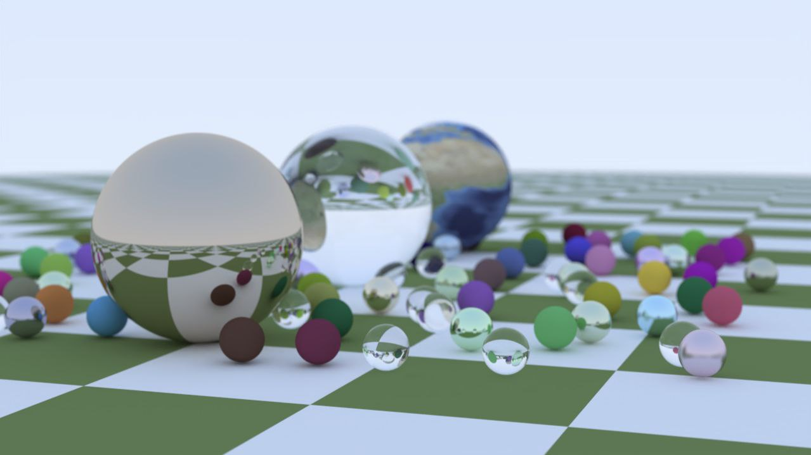
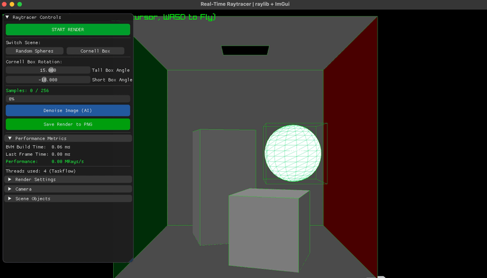
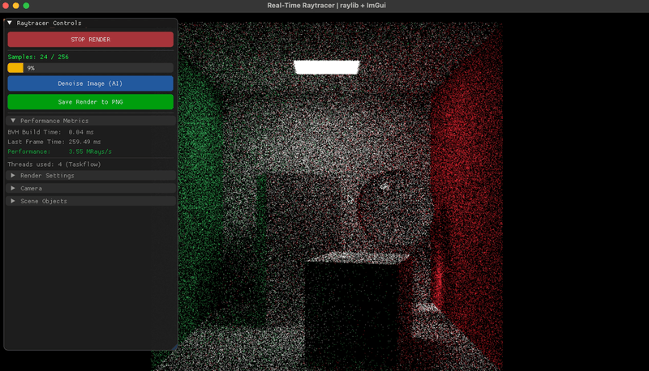
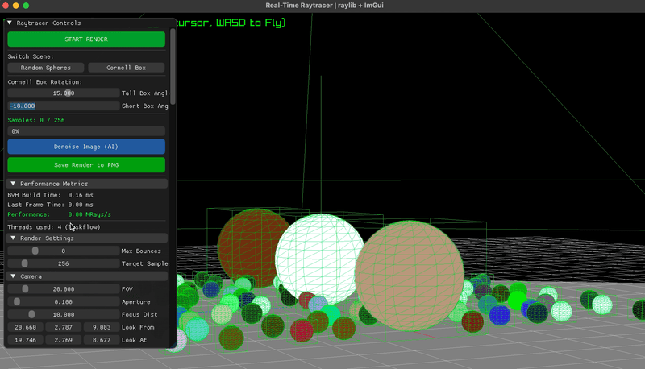

# RayTracingRayLib - High-Performance CPU Path Tracer


A production-grade, CPU-side Monte Carlo path tracer engineered from scratch. Built with a strict focus on **Data-Oriented Design**, hardware-sympathetic memory layout, and advanced acceleration structures. 

The engine features a parallel tile-based render pipeline, Intel Open Image Denoise (OIDN) integration, and a custom **Binned SAH BVH** - all running interactively within a Raylib viewport.

<div align="center">
  
</div>

<br>

## Engine Features in Action

<table>
  <tr>
    <td align="center"><b>Multithreaded BVH & Rendering</b></td>
    <td align="center"><b>AI Denoising (Intel OIDN)</b></td>
    <td align="center"><b>Heavy Mesh LOD & Gizmo</b></td>
  </tr>
  <tr>
    <td></td>
    <td></td>
    <td></td>
  </tr>
</table>

<br>

## Architecture & Algorithmic Highlights

### 1. Parallel Binned SAH BVH Construction
To handle massive meshes interactively, the engine utilizes the **Surface Area Heuristic (SAH)** evaluated across fixed bins (`BINS = 8`) to find the mathematically optimal spatial splits. Tree construction is parallelized via `std::async` for nodes containing >256 primitives, processing left/right branches asynchronously. This reduces the build time of a 30,000+ triangle mesh to **~0.5 milliseconds**.

### 2. Flattened Memory Layout & Iterative Traversal
Unlike standard recursive raytracers, this engine is built for maximum L1/L2 cache utilization:
* **Contiguous Memory:** The BVH tree is flattened into a `std::vector<LinearBvhNode>`. Each node is tightly packed into exactly 32 bytes (AABB bounds + offsets).
* **Zero Recursion:** Ray traversal is strictly iterative. It utilizes a highly optimized `while` loop and a small `int stack[64]` allocated in hot CPU registers/L1 cache, completely eliminating function call overhead and stack fragmentation.

### 3. Parallel Tile Dispatch (`cpp-taskflow`)
The render loop decomposes the framebuffer into **16×16 pixel tiles**. Each tile is dispatched as an independent work unit to a `tf::Executor` thread pool. Tile granularity keeps each thread's working set hot in private cache while saturating all logical cores with zero synchronization overhead.

### 4. Zero-Allocation Hot Paths
During the `renderSample()` loop, **no dynamic memory allocation (`new` / `malloc`) occurs**. Three flat `std::vector<Vec3>` buffers (`accum`, `albedo`, `normal`) are pre-allocated during viewport resize. This ensures the pixel-stride memory access pattern remains purely sequential, maximizing CPU prefetcher effectiveness.

### 5. Intel Open Image Denoise (OIDN) Integration
The engine extracts Primary Albedo and Normal AOVs directly from the first bounce of the Monte Carlo integration. These are fed into the OIDN neural network alongside the noisy HDR color buffer, enabling publication-quality, noise-free convergence at extremely low Sample-Per-Pixel (SPP) counts.

### 6. Stochastic Path Termination
To optimize calculation depth without biased energy loss, stochastic early termination is applied from depth 3 onward. Paths with low energy throughput are probabilistically terminated, recovering massive computational resources in heavily shadowed scenes while preserving identical expected pixel values.

---

## Performance Benchmarks

Measured on **[2.3 GHz Dual-Core Intel Core i5]**, Release build (`-O3 -march=native`), resolution **1280×720**.

| Scene Complexity | Benchmark Metric | Result | Notes |
| :--- | :--- | :--- | :--- |
| **Light** (Cornell Box) | **Peak Ray Throughput** | `~3.74 MRays/s` | Multi-threaded rendering (Taskflow) |
| **Heavy** (~30k Tris) | **BVH Build Time** | `~0.51 ms` | Powered by `std::async` parallel Binned SAH |
| **Heavy** (~30k Tris) | **Heavy Ray Throughput**| `~0.44 MRays/s` | Deep tree traversal & triangle intersections |

## Notable Engineering Challenges & Solutions

* **Custom 3D Transform Gizmo & Raycasting:**
  * **Problem:** Implementing interactive scene editing required a robust way to select and manipulate objects in 3D space without relying on heavy external libraries like ImGuizmo.
  * **Solution:** Engineered a custom 3D Gizmo system from scratch. Implemented precise ray-casting algorithms to detect intersections between the mouse cursor (unprojected from screen space to world space) and the mathematical primitive shapes (cylinders/cones) of the Gizmo axes.
  * **Result:** Achieved pixel-perfect, dependency-free 3D object manipulation directly within the Raylib viewport, demonstrating a strong grasp of linear algebra and spatial transformations.
* **The CPU-Bound Draw Call Bottleneck:**
  * **Problem:** Rendering heavy meshes (~30,000 triangles) in Raylib's immediate mode during the editor preview required over 150,000 draw calls per frame. This choked the CPU, dropping the editor to unplayable framerates during Gizmo dragging.
  * **Solution:** Implemented a custom **Viewport Level of Detail (LOD)** system. When a mesh exceeds a primitive threshold, the editor dynamically falls back to a sparse representation (rendering only 10% of the faces and disabling wireframes). 
  * **Result:** Restored a flawless 60+ FPS interactively, while keeping the 100% accurate geometry untouched in memory for the actual Path Tracing pass.

* **Cache Misses in Deep Tree Traversal:**
  * **Problem:** Traditional recursive BVH traversal caused constant L1/L2 cache misses and stack frame allocation overhead, crippling ray throughput on deep trees.
  * **Solution:** Re-architected the tree memory layout to be strictly Data-Oriented. The tree was flattened into contiguous memory arrays, and recursion was replaced with an iterative `while` loop using a highly-localized fixed stack (`int stack[64]`).
  * **Result:** Drastically reduced CPU memory stalls, ensuring the processor spends time doing floating-point math rather than waiting on RAM fetches.

## Controls & Navigation

The engine features a seamless toggle between Camera Mode and UI Mode for a smooth editing experience:

* **Mode Toggle (`TAB`):** Press `TAB` to switch between **Preview/Camera Mode** (for navigating the scene) and **UI/Editor Mode** (for interacting with menus and objects).
* **Camera Movement (Preview Mode):** Use `W`, `A`, `S`, `D` keys to fly around. Simply move your mouse to rotate the camera (no holding buttons required).
* **Scene Editing (UI Mode):** `Left Click` on any object to select it. Use the colored Gizmo arrows to translate the object in 3D space.
* **Rendering:** Hit the **"START RENDER"** button in the UI panel to begin path tracing. Once you have enough samples, click **"Denoise Image (AI)"** for a noise-free final result.

---

## Build Instructions

The project uses Modern CMake and automatically handles dependencies.

### Dependencies
* **Raylib** (Windowing & Inputs)
* **ImGui** (Interactive UI)
* **Taskflow** (Parallel execution graph)
* **Intel OIDN** (AI Denoising)
* **tinyobjloader** (OBJ parsing)

### Compiling from source

```bash
# 1. Clone the repository
git clone https://github.com/megatr4n/RayTracingRayLib.git
cd RayTracingRayLib

# 2. Create a build directory
mkdir build && cd build

# 3. Configure and build in Release mode (Crucial for performance!)
cmake .. -DCMAKE_BUILD_TYPE=Release
cmake --build . --config Release --parallel

# 4. Run the engine! (Cross-platform)
cmake --build . --target run
